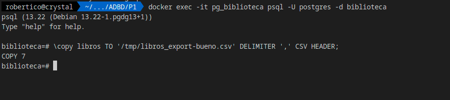

# Práctica 1 ADBD.

## 1

```sql
CREATE DATABASE biblioteca;
```

## 2

### a

#### i.

```sql
CREATE USER admin_biblio WITH LOGIN PASSWORD 'admin_pass';
ALTER DATABASE biblioteca OWNER TO admin_biblio;
```

#### ii.

```sql
CREATE USER usuario_biblio WITH LOGIN PASSWORD 'user_pass';
GRANT SELECT ON ALL TABLES IN SCHEMA public TO usuario_biblio;
ALTER DEFAULT PRIVILEGES IN SCHEMA public GRANT SELECT ON TABLES TO usuario_biblio;
```

### b

```sql
CREATE ROLE lectores;
GRANT SELECT, INSERT, UPDATE, DELETE ON ALL TABLES IN SCHEMA public TO lectores;
ALTER DEFAULT PRIVILEGES IN SCHEMA public GRANT SELECT, INSERT, UPDATE, DELETE ON TABLES TO lectores;
```

### c

```sql
GRANT lectores TO usuario_biblio;
```

### d

```sql
SELECT rolname FROM pg_roles;
```

### e

```sql
ALTER USER usuario_biblio WITH PASSWORD 'new_pass';
```

### f

```sql
REVOKE DELETE ON ALL TABLES IN SCHEMA public FROM lectores;
ALTER DEFAULT PRIVILEGES IN SCHEMA public REVOKE DELETE ON TABLES FROM lectores;
```


## 3

### a

#### i.

```sql
CREATE TABLE autores (
  id_autor SERIAL PRIMARY KEY,
  nombre TEXT,
  nacionalidad TEXT
);
```

#### ii.

```sql
CREATE TABLE libros (
  id_libro SERIAL PRIMARY KEY,
  titulo TEXT,
  anio_publicacion INTEGER,
  id_autor INTEGER REFERENCES autores ON DELETE SET NULL
);
```

#### iii.

```sql
CREATE TABLE prestamos (
  id_prestamo SERIAL PRIMARY KEY,
  id_libro INTEGER NOT NULL REFERENCES libros ON DELETE CASCADE,
  fecha_prestamo DATE,
  fecha_devolucion DATE,
  usuario_prestatario TEXT
);
```


## 4

```sql
INSERT INTO autores (nombre, nacionalidad) VALUES
  ('Gabriel García Márquez', 'Colombiana'),
  ('J. K. Rowling', 'Británica'),
  ('Jane Austen', 'Británica'),
  ('Haruki Murakami', 'Japonesa'),
  ('Isabel Allende', 'Chilena');

INSERT INTO libros (titulo, anio_publicacion, id_autor) VALUES
  ('Cien años de soledad', 1967, 1),
  ('Harry Potter y la piedra filosofal', 1997, 2),
  ('Harry Potter y la cámara secreta', 1998, 2),
  ('Orgullo y prejuicio', 1813, 3),
  ('Kafka en la orilla', 2002, 4),
  ('Tokio Blues', 1987, 4),
  ('La casa de los espíritus', 1982, 5),
  ('Eva luna', 1987, 5);

INSERT INTO prestamos (id_libro, fecha_prestamo, fecha_devolucion, usuario_prestatario) VALUES
  (1, '2025-09-01', NULL, 'alumno1'),
  (2, '2025-08-20', '2025-08-30', 'alumno2'),
  (3, '2025-09-05', NULL, 'alumno3'),
  (4, '2025-07-10', '2025-07-20', 'alumno4'),
  (1, '2025-06-01', '2025-06-10', 'alumno5');
```

## 5

### a

```sql
SELECT titulo, nombre FROM libros NATURAL JOIN autores;
```


### b

```sql
SELECT * FROM prestamos WHERE fecha_devolucion IS NULL;
```

Al no tener ninguno con una fecha de devolución nula no nos aparece ningun registro.


### c

```sql
SELECT nombre
FROM libros NATURAL JOIN autores
GROUP BY nombre, id_autor
HAVING COUNT(*) > 1;
```


## 6

### a

```sql
SELECT COUNT(*) AS total_prestamos FROM prestamos;
```


### b

```sql
SELECT usuario_prestatario, COUNT(*) AS prestamos_por_usuario
FROM prestamos
GROUP BY usuario_prestatario;
```


## 7

### a

```sql
UPDATE prestamos SET fecha_devolucion = CURRENT_DATE WHERE id_prestamo = 1;
```


### b

```sql
DELETE FROM libros WHERE id_libro = 3;
SELECT * FROM prestamos;
```


## 8

### a

```sql
CREATE VIEW vista_libros_prestados AS
SELECT titulo, nombre, usuario_prestatario
FROM autores NATURAL JOIN libros NATURAL JOIN prestamos;

GRANT SELECT ON vista_libros_prestados TO usuario_biblio;
```


## 9

### a

```sql
CREATE OR REPLACE FUNCTION libros_por_autor(nombre_autor TEXT)
RETURNS TABLE(libro_id INT, titulo_libro TEXT) AS $$
BEGIN
  RETURN QUERY
  SELECT id_libro, titulo
  FROM libros
  NATURAL JOIN autores
  WHERE nombre = nombre_autor;
END;
$$ LANGUAGE plpgsql;

SELECT * FROM libros_por_autor('Jane Austen');
```


### b

```sql
SELECT titulo, COUNT(*) AS veces_prestado
FROM prestamos
NATURAL JOIN libros
GROUP BY titulo
ORDER BY veces_prestado DESC
LIMIT 3;
```


## 10

### a



### b


